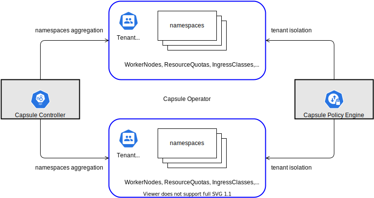

# Capsule Overview

## Kubernetes multi-tenancy made easy
**Capsule** implements a multi-tenant and policy-based environment in your Kubernetes cluster. It is designed as a micro-services-based ecosystem with the minimalist approach, leveraging only on upstream Kubernetes.

## What's the problem with the current status?

Kubernetes introduces the _Namespace_ object type to create logical partitions of the cluster as isolated *slices*. However, implementing advanced multi-tenancy scenarios, it soon becomes complicated because of the flat structure of Kubernetes namespaces and the impossibility to share resources among namespaces belonging to the same tenant. To overcome this, cluster admins tend to provision a dedicated cluster for each groups of users, teams, or departments. As an organization grows, the number of clusters to manage and keep aligned becomes an operational nightmare, described as the well known phenomena of the _clusters sprawl_.

## Entering Capsule

Capsule takes a different approach. In a single cluster, the Capsule Controller aggregates multiple namespaces in a lightweight abstraction called _Tenant_, basically a grouping of Kubernetes Namespaces. Within each tenant, users are free to create their namespaces and share all the assigned resources. 

On the other side, the Capsule Policy Engine keeps the different tenants isolated from each other. _Network and Security Policies_, _Resource Quota_, _Limit Ranges_, _RBAC_, and other policies defined at the tenant level are automatically inherited by all the namespaces in the tenant. Then users are free to operate their tenants in autonomy, without the intervention of the cluster administrator. 

