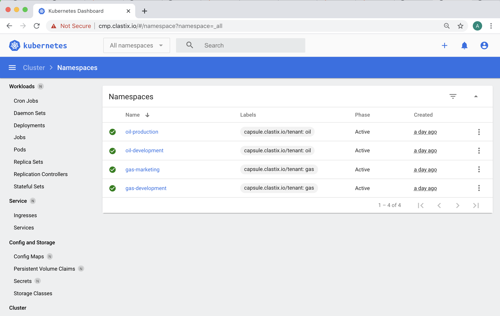

# How it works

The `capsule-proxy` component implements a simple reverse proxy that intercepts only specific requests to the APIs server and Capsule does all the magic behind the scenes.

The current implementation filters the following requests:

* `/api/scheduling.k8s.io/{v1}/priorityclasses{/name}`
* `/api/v1/namespaces{/name}`
* `/api/v1/nodes{/name}`
* `/api/v1/pods?fieldSelector=spec.nodeName%3D{name}`
* `/apis/coordination.k8s.io/v1/namespaces/kube-node-lease/leases/{name}`
* `/apis/metrics.k8s.io/{v1beta1}/nodes{/name}`
* `/apis/networking.k8s.io/{v1,v1beta1}/ingressclasses{/name}`
* `/apis/storage.k8s.io/v1/storageclasses{/name}`
* `/apis/node.k8s.io/v1/runtimeclasses{/name}`
* `/api/v1/persistentvolumes{/name}`

All other requests are proxy-passed transparently to the API server, so no side effects are expected.
We're planning to add new APIs in the future, so [PRs are welcome](https://github.com/projectcapsule/capsule-proxy)!

## User Authentication

The `capsule-proxy` intercepts all the requests from the `kubectl` client directed to the APIs Server. Users using a TLS client-based authentication with a certificate and key can talk with the API Server since it can forward client certificates to the Kubernetes APIs server.

It is possible to protect the `capsule-proxy` using a certificate provided by Let's Encrypt. Keep in mind that, in this way, the TLS termination will be executed by the Ingress Controller, meaning that the authentication based on the client certificate will be withdrawn and not reversed to the upstream.

If your prerequisite is exposing `capsule-proxy` using an Ingress, you must rely on the token-based authentication, for example, OIDC or Bearer tokens. Users providing tokens are always able to reach the APIs Server.

## Kubernetes dashboards integration

If you're using the [Kubernetes Dashboard](https://github.com/kubernetes/dashboard), the `capsule-proxy` can be deployed as a sidecar container in the backend, following the well-known cloud-native _Ambassador Pattern_.



## Tenant Owner Authorization

Each Tenant owner can have their capabilities managed pretty similar to a standard Kubernetes RBAC.

```yaml
apiVersion: capsule.clastix.io/v1beta2
kind: Tenant
metadata:
  name: my-tenant
spec:
  owners:
  - kind: User
    name: alice
    proxySettings:
    - kind: IngressClasses
      operations:
      - List
```

The proxy setting `kind` is an __enum__ accepting the supported resources:

- `Nodes`
- `StorageClasses`
- `IngressClasses`
- `PriorityClasses`
- `RuntimeClasses`
- `PersistentVolumes`

Each Resource kind can be granted with several verbs, such as:

- `List`
- `Update`
- `Delete`

